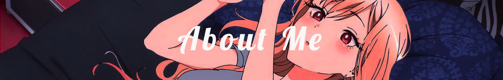
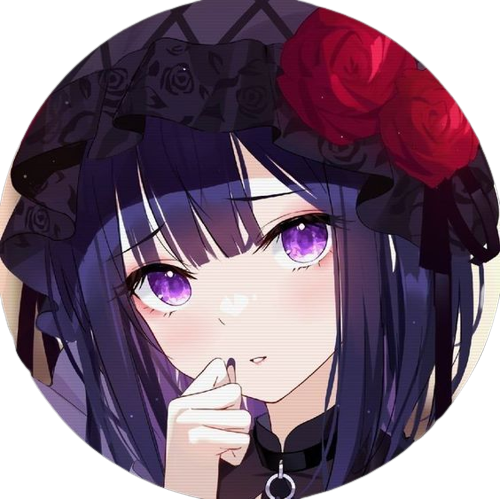
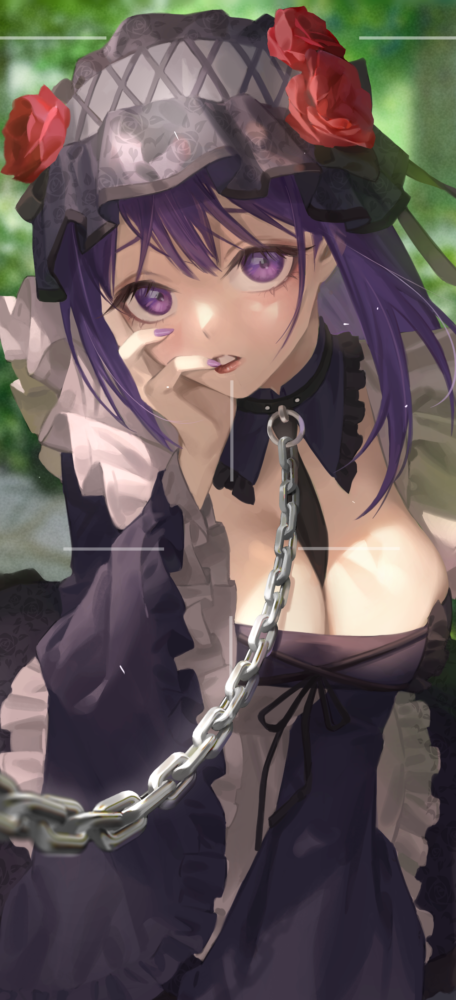
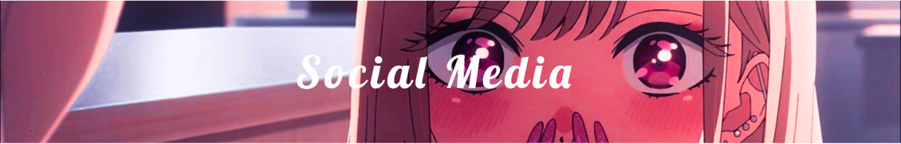

<head>
  <link rel="stylesheet" href="css/index.css">
</head>

<body>
  

  

  

    
  

  

  

    
  

  I'm it.kaira_, a 20 years old, University student from VietNam.
  - Gender :  Male
  - Favorites : ⚽ Football, 🏀 Basketball, 🎸 Guitar,...
  - Some games :  Valorant,  CSGO,  Fo4,  AoV,...
  - My skills :  JavaScript,  NodeJS,  MySQL,  SQL and skills that I know  Python,  C++,  Java,  HTML5,  CSS,  PHP,  MongoDB,  TypeScript,  Vue,  React,  Adobe Photoshop,  Git,...

  

  

  

  

    
  

  

  

    
  

  

    
    

    
    

    
  

  

  

     
  

  

  

     
  

  

  

  

  

    
  

  

  

    
  

  

    <a href="https://discord.com/users/882173065163849739" target="_blank">
      

    </a>
    <a href="https://www.youtube.com/@it.kaira_?sub_confirmation=1" target="_blank">
      

    </a>
    <a href="https://github.com/itkaira03" target="_blank">
      

    </a>
  

  

  

  

  

    
  

  

  

    
  

</body>
